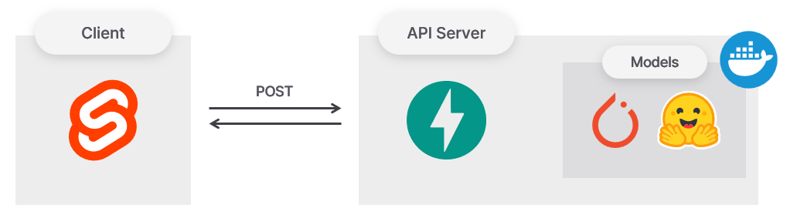

# Serve ML models



[run.bat](run.bat)

```bash
@echo off
:: Activate conda environment
call conda activate MY_ENV

:: Start FastAPI server in the background
start uvicorn src.lib.server.main:app --host=0.0.0.0 --port=8001 --reload

:: Start Svelte server
npm run dev
```

## FrontEnd

- SvelteKit: [src/routes](/src/routes)
- Vercel

## BackEnd

- FastAPI: [src/lib/server](/src/lib/server)
- Render

### Image model

- Fine-tuned MobileNet for Fashion-MNIST classification
- Model: [src/lib/server/MobileNet](src/lib/server/MobileNet)

### Text model

- Compressed LLM (Mistral-7B-v0.1) for text generation
- Model: [src/lib/server/Mistral](src/lib/server/Mistral)

## Blog

post: [한국어](https://denev6.github.io/playground/2025/01/17/ml-api.html)
